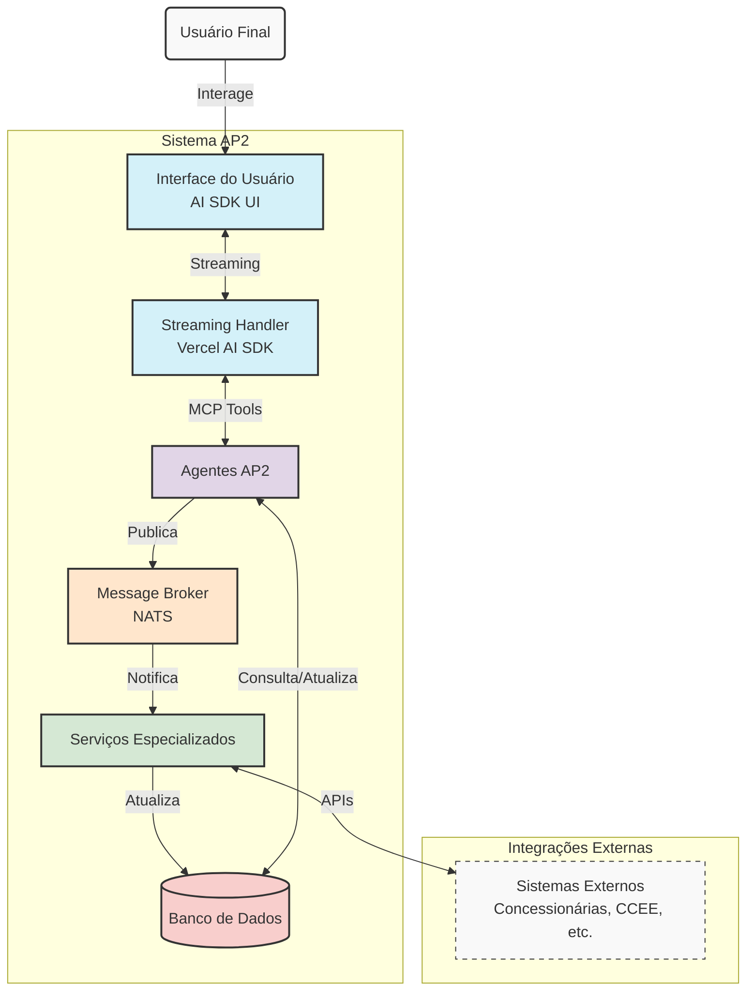
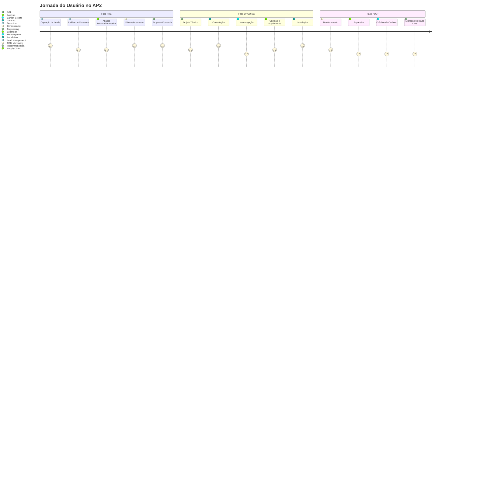

<a href="https://streamdown.ai/">
  
  <h1 align="center">AP2 - Auto Portal Photovoltaico</h1>
</a>

<p align="center">
    AP2 é uma plataforma completa para gestão do ciclo de vida de sistemas fotovoltaicos, usando agentes especializados, Model Context Protocol (MCP) e mensageria NATS.
</p>

<p align="center">
  <a href="https://streamdown.ai/docs"><strong>Documentação</strong></a> ·
  <a href="#recursos"><strong>Recursos</strong></a> ·
  <a href="#arquitetura"><strong>Arquitetura</strong></a> ·
  <a href="#fluxo-do-usuario"><strong>Fluxo do Usuário</strong></a> ·
  <a href="#execucao-local"><strong>Execução Local</strong></a>
</p>
<br/>

## Recursos

- **Agentes Especializados**
  - Detecção, Análise, Dimensionamento, Recomendação, e mais
  - Fases: PRE (pré-instalação), ONGOING (instalação) e POST (pós-instalação)
  - Cada agente com ferramentas especializadas via MCP (Model Context Protocol)

- **Arquitetura Moderna**
  - [Next.js](https://nextjs.org) App Router
  - React Server Components (RSCs)
  - [Vercel AI SDK](https://ai-sdk.dev/docs/introduction) para streaming de respostas
  - [NATS](https://nats.io) para mensageria entre agentes e serviços

- **Interface Rica**
  - Componentes visuais especializados (Artifacts) para cada etapa
  - Estilização com [Tailwind CSS](https://tailwindcss.com)
  - Componentes de [Radix UI](https://radix-ui.com) para acessibilidade

- **Conformidade e Segurança**
  - Compliance com a Lei 14.300/2022 (Microgeração Distribuída)
  - LGPD: gestão cuidadosa de dados pessoais
  - Registro SINARE para créditos de carbono (Decreto 11.075/2022)

## Arquitetura

O AP2 é construído como um sistema de agentes interconectados via NATS, cada um especializado em uma fase específica do ciclo de vida de sistemas fotovoltaicos:



Cada agente:
1. Recebe dados de entrada (validados por schema)
2. Executa ferramentas especializadas via MCP
3. Constrói uma resposta estruturada (também validada)
4. Publica eventos relevantes no NATS
5. Retorna resultados com hints para a UI renderizar componentes visuais (Artifacts)

## Fluxo do Usuário

A jornada do usuário no AP2 segue um fluxo natural desde a captação do lead até a gestão pós-instalação:



Veja mais detalhes no [BLUEPRINT.md](BLUEPRINT.md) e na [documentação completa](https://streamdown.ai/docs).

## Execução Local

Você precisará das variáveis de ambiente definidas em `.env.example` para executar o AP2. Recomendamos usar as [Variáveis de Ambiente do Vercel](https://vercel.com/docs/projects/environment-variables), mas um arquivo `.env` também funciona.

> Nota: Não faça commit do seu arquivo `.env` ou você exporá segredos que permitirão a outros controlar o acesso às suas contas de provedores de IA e autenticação.

1. Instale a CLI do Vercel: `npm i -g vercel`
2. Vincule a instância local com as contas do Vercel e GitHub (cria o diretório `.vercel`): `vercel link`
3. Baixe suas variáveis de ambiente: `vercel env pull`

```bash
pnpm install
pnpm dev
```

Seu aplicativo deve estar rodando em [localhost:3000](http://localhost:3000).

## Configuração de Desenvolvimento

Para desenvolvimento, recomendamos usar o ambiente de pré-produção:

```bash
pnpm env:preprod:use   # Configura para ambiente de pré-produção
pnpm dev:preprod       # Inicia o servidor em modo pré-produção
```

## Documentação

Para acessar a documentação completa, execute:

```bash
cd ysh-docs      # Entre no diretório da documentação 
pnpm dev         # Inicia o servidor de documentação
```

A documentação estará disponível em [localhost:3001](http://localhost:3001).

## Licença

O AP2 é licenciado sob a [Licença MIT](LICENSE).
