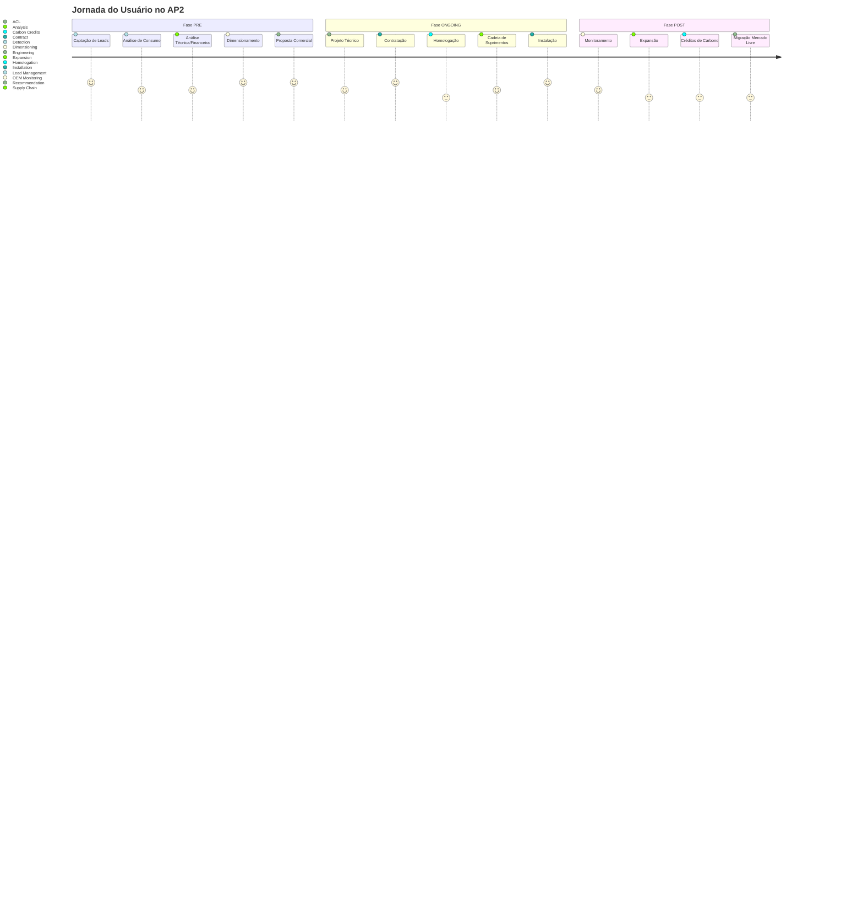

# Agentes e Ferramentas AP2

O AP2 utiliza uma arquitetura de agentes especializados, cada um responsável por uma fase específica do ciclo de vida de sistemas fotovoltaicos. Cada agente implementa ferramentas via Model Context Protocol (MCP) e se comunica através do sistema de mensageria NATS.

## Jornada do Usuário

## Fase PRE (Planejamento)

### 1. Detection Agent

- **Função**: Detectar anomalias de consumo, pontuar risco e validar compliance (Lei 14.300).
- **Ferramentas**:
  - `detection.anomaly`
  - `detection.risk_score`
  - `detection.pattern_recognition`
  - `detection.compliance_validation`
- **Eventos NATS**:
  - `ap2.pre.detection.anomaly.detected.v1`
  - `ap2.pre.detection.risk.calculated.v1`
  - `ap2.pre.detection.pattern.identified.v1`
  - `ap2.pre.detection.compliance.validated.v1`

### 2. Analysis Agent

- **Função**: Validar consumo, simular financiamento, avaliar local e calcular pré-dimensionamento.
- **Ferramentas**:
  - `analysis.consumption_validation`
  - `analysis.financing_simulation`
  - `analysis.site_assessment`
  - `analysis.pre_sizing`
- **Eventos NATS**:
  - `ap2.pre.analysis.consumption.validated.v1`
  - `ap2.pre.analysis.financing.simulated.v1`
  - `ap2.pre.analysis.site.assessed.v1`
  - `ap2.pre.analysis.sizing.calculated.v1`

### 3. Dimensioning Agent

- **Função**: Dimensionar tamanho ótimo, layout, geração e BOM.
- **Ferramentas**:
  - `dimensioning.system_size`
  - `dimensioning.panel_layout`
  - `dimensioning.generation_estimate`
  - `dimensioning.bom`
- **Eventos NATS**:
  - `ap2.pre.dimensioning.size.calculated.v1`
  - `ap2.pre.dimensioning.layout.optimized.v1`
  - `ap2.pre.dimensioning.generation.estimated.v1`
  - `ap2.pre.dimensioning.bom.generated.v1`

### 4. Recommendation Agent

- **Função**: Gerar kits/propostas, otimizar financiamento e esboçar contrato.
- **Ferramentas**:
  - `recommendation.product`
  - `recommendation.proposal_draft`
  - `recommendation.financing_optimization`
  - `recommendation.contract_draft`
- **Eventos NATS**:
  - `ap2.pre.recommendation.product.selected.v1`
  - `ap2.pre.recommendation.proposal.generated.v1`
  - `ap2.pre.recommendation.financing.optimized.v1`
  - `ap2.pre.recommendation.contract.drafted.v1`

### 5. Lead Management Agent

- **Função**: CRM de leads com LGPD.
- **Ferramentas**:
  - `lead_management.lead_record`
  - `lead_management.status_transitions`
  - `lead_management.consent_logs`
  - `lead_management.enrichment_audit`
- **Eventos NATS**:
  - `ap2.pre.lead.record.created.v1`
  - `ap2.pre.lead.status.updated.v1`
  - `ap2.pre.lead.consent.logged.v1`
  - `ap2.pre.lead.enrichment.audited.v1`

## Fase ONGOING (Execução)

### 1. Engineering Agent

- **Função**: Projeto detalhado, ART/TRT, validação estrutural e especificações.
- **Ferramentas**:
  - `engineering.detailed_design`
  - `engineering.art_trt_generation`
  - `engineering.structural_validation`
  - `engineering.technical_specs`
- **Eventos NATS**:
  - `ap2.ongoing.engineering.design.completed.v1`
  - `ap2.ongoing.engineering.documentation.generated.v1`
  - `ap2.ongoing.engineering.structure.validated.v1`
  - `ap2.ongoing.engineering.specs.defined.v1`

### 2. Contract Agent

- **Função**: Gerar contratos (fornecimento/instalação), garantias/seguros e termos de responsabilidade.
- **Ferramentas**:
  - `contract.document_generation`
  - `contract.digital_signature`
  - `contract.amendments`
  - `contract.compliance_check`
- **Eventos NATS**:
  - `ap2.ongoing.contract.document.generated.v1`
  - `ap2.ongoing.contract.signature.completed.v1`
  - `ap2.ongoing.contract.amendment.processed.v1`
  - `ap2.ongoing.contract.compliance.verified.v1`

### 3. Homologation Agent

- **Função**: Protocolar acesso, processar respostas, rastrear protocolos e obter aprovação técnica.
- **Ferramentas**:
  - `homologation.utility_request`
  - `homologation.utility_response`
  - `homologation.protocol_tracking`
  - `homologation.technical_approval`
- **Eventos NATS**:
  - `ap2.ongoing.homologation.request.submitted.v1`
  - `ap2.ongoing.homologation.response.received.v1`
  - `ap2.ongoing.homologation.protocol.updated.v1`
  - `ap2.ongoing.homologation.approval.granted.v1`

### 4. Supply Chain Agent

- **Função**: Disponibilidade, POs, logística e fornecedores.
- **Ferramentas**:
  - `supply_chain.inventory_check`
  - `supply_chain.purchase_order`
  - `supply_chain.logistics_planning`
  - `supply_chain.vendor_management`
- **Eventos NATS**:
  - `ap2.ongoing.supply_chain.inventory.checked.v1`
  - `ap2.ongoing.supply_chain.order.placed.v1`
  - `ap2.ongoing.supply_chain.logistics.planned.v1`
  - `ap2.ongoing.supply_chain.vendor.managed.v1`

### 5. Installation Agent

- **Função**: Agenda, equipes, checklist e comissionamento.
- **Ferramentas**:
  - `installation.schedule`
  - `installation.crew_assignment`
  - `installation.checklist`
  - `installation.commissioning`
- **Eventos NATS**:
  - `ap2.ongoing.installation.scheduled.v1`
  - `ap2.ongoing.installation.crew.assigned.v1`
  - `ap2.ongoing.installation.checklist.completed.v1`
  - `ap2.ongoing.installation.commissioned.v1`

## Fase POST (Operação)

### 1. OEM Monitoring Agent

- **Função**: Ativar telemetria, analisar performance, detectar anomalias e agendar manutenção.
- **Ferramentas**:
  - `oem_monitoring.telemetry_activation`
  - `oem_monitoring.performance_analysis`
  - `oem_monitoring.anomaly_detection`
  - `oem_monitoring.maintenance_scheduling`
- **Eventos NATS**:
  - `ap2.post.telemetry.activated.v1`
  - `ap2.post.performance.analyzed.v1`
  - `ap2.post.anomaly.detected.v1`
  - `ap2.post.maintenance.scheduled.v1`

### 2. Expansion Agent

- **Função**: Identificar upsell, dimensionar baterias, analisar EV charger e retrofit.
- **Ferramentas**:
  - `expansion.upsell_recommendation`
  - `expansion.battery_sizing`
  - `expansion.ev_charger_analysis`
  - `expansion.retrofit_assessment`
- **Eventos NATS**:
  - `ap2.post.expansion.upsell.recommended.v1`
  - `ap2.post.expansion.battery.sized.v1`
  - `ap2.post.expansion.ev.analyzed.v1`
  - `ap2.post.expansion.retrofit.assessed.v1`

### 3. Carbon Credits Agent

- **Função**: MRV, registro SINARE, cálculo e transações.
- **Ferramentas**:
  - `carbon_credits.mrv`
  - `carbon_credits.sinare_registration`
  - `carbon_credits.credits_calculation`
  - `carbon_credits.transaction_management`
- **Eventos NATS**:
  - `ap2.post.carbon_credits.mrv.completed.v1`
  - `ap2.post.carbon_credits.registered.v1`
  - `ap2.post.carbon_credits.calculated.v1`
  - `ap2.post.carbon_credits.transacted.v1`

### 4. ACL Agent

- **Função**: Migração ao mercado livre: análise, leilões, PPA e registro CCEE.
- **Ferramentas**:
  - `acl_agent.migration_analysis`
  - `acl_agent.auction_participation`
  - `acl_agent.ppa_management`
  - `acl_agent.ccee_registration`
- **Eventos NATS**:
  - `ap2.post.acl.migration.analyzed.v1`
  - `ap2.post.acl.auction.participated.v1`
  - `ap2.post.acl.ppa.managed.v1`
  - `ap2.post.acl.ccee.registered.v1`

## Convenções e Padrões

### Convenções NATS (subjects)

- Padrão: `ap2.<fase>.<agente>.<evento>.v1`
- Wildcards (assinantes): `*` (uma parte), `>` (uma ou mais partes)

### UI Hints (Artifacts)

- Componentes visuais especializados para cada fase e agente
- Exemplos: `RiskGauge`, `BOMTable`, `Proposal`, etc.

### Formato de Resposta

- JSON estrito (sem texto fora do JSON)
- Campos padrão em todos os outputs:
  - `status`: `"ok" | "error"`
  - `agent`: slug do agente (ex.: `"detection"`)
  - `timestamp`: ISO8601
  - `reasoning_brief?`: string curta (≤ 240 chars)
  - `ui_hints?`: instruções leves p/ UI (gráficos, gauges, tabelas)
