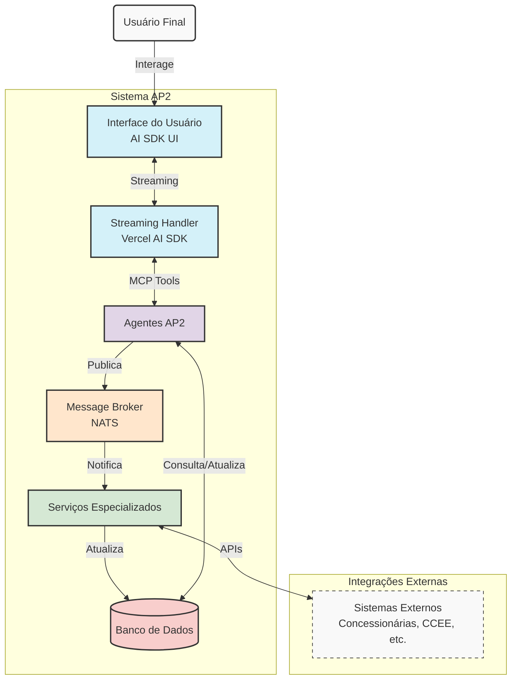

# Arquitetura do Sistema AP2

O AP2 é construído como um sistema de agentes interconectados via NATS, cada um especializado em uma fase específica do ciclo de vida de sistemas fotovoltaicos.

## Diagrama de Arquitetura

## Componentes Principais

### 1. Interface do Usuário (UI)
- Construída com Next.js App Router e React Server Components
- Usa AI SDK UI para componentes visuais especializados (Artifacts)
- Streaming de respostas para experiência fluida

### 2. Streaming Handler
- Baseado no Vercel AI SDK
- Gerencia fluxo de dados entre UI e agentes
- Suporta streaming bidirecional

### 3. Agentes AP2
- Cada agente é especializado em uma fase e função específica
- Implementam o Model Context Protocol (MCP) para ferramentas
- Validam esquemas de entrada/saída rigorosamente

### 4. Message Broker (NATS)
- Sistema de mensageria de alto desempenho
- Padrão de nomenclatura: `ap2.<fase>.<agente>.<evento>.v1`
- Suporta wildcards para assinatura flexível

### 5. Serviços Especializados
- Processamento assíncrono de tarefas
- Integração com sistemas externos
- Lógica de negócio específica

### 6. Banco de Dados
- Armazenamento persistente
- Histórico de interações
- Configurações e preferências

## Fluxo de Processamento

1. O usuário interage com a interface
2. A requisição é processada pelo streaming handler
3. Os agentes AP2 recebem os dados e validam
4. Ferramentas MCP são executadas pelos agentes
5. Resultados são publicados no NATS
6. Serviços assinam eventos relevantes
7. UI é atualizada com novos dados
8. Artifacts (componentes visuais) são renderizados

## Integrações Externas

- Concessionárias de energia
- CCEE (Câmara de Comercialização de Energia Elétrica)
- Serviços financeiros
- APIs de clima e dados solares
- Sistemas ERP/CRM

## Tecnologias Utilizadas

- **Frontend**: Next.js, React, Tailwind CSS, Radix UI
- **Backend**: Node.js, TypeScript
- **Mensageria**: NATS
- **Database**: PostgreSQL
- **Deployment**: Vercel